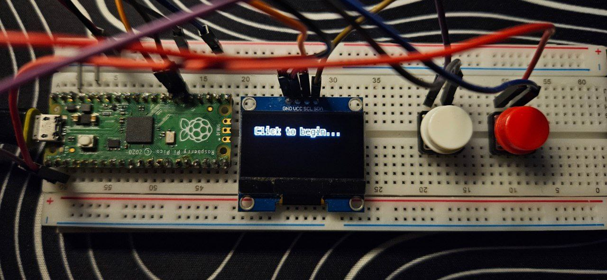

# Pico Macro Deck Prototype

This simple interface comprises of a Raspberry Pico, 2 button inputs and an Adafruit SH1106 I2C controller. This project leverages the following Repositories:

* [Adafruit CircuitPython Display Text](https://github.com/adafruit/Adafruit_CircuitPython_Display_Text)
* [Adafruit CircuitPython Display Layout](https://github.com/adafruit/Adafruit_CircuitPython_DisplayIO_Layout)
* [Adafruit CircuitPython DisplayIO SH1106](https://github.com/adafruit/Adafruit_CircuitPython_DisplayIO_SH1106)
* [Adafruit CircuitPython HID](https://github.com/adafruit/Adafruit_CircuitPython_HID)

## Pinouts

| I2C 	| Pico     	|
|-----	|----------	|
| SCL 	| GP21     	|
| SDA 	| GP20     	|
| GND 	| GND      	|
| VCC 	| 3V3(OUT) 	|

## Functionalities

The functions are straightforward:

* Button 1 cycles between different macros configured in `code.py`
* Button 2 executes the selected macro

## Adding new macros

A new function can be defined in `code.py` as such:
```python
def hiberate():
    kbd.send(Keycode.WINDOWS, Keycode.R)
    time.sleep(0.1)
    KeyboardLayoutUS(kbd).write('shutdown /h')
    kbd.send(Keycode.ENTER)
    return 'Hibernating...'
    # The return value would be the text displayed after the macro has been executed
```

the `text` dictionary should just be updated accordingly to map the new function, where the key would be the title of the macro displayed on the screen.
```python
text = {'Say Hi': hello,
        'Random number from 0 to 9': rand,
        'CTRL+ALT+DEL': ctrlaltdel,
        'Hiberate PC': hiberate}
```

## Macros currently in `code.py`

### `hello()`
Sends keystrokes of 'hello' into your computer.

### `rand()`
Sends a keystroke of a random integer into your computer.

### `ctrlaltdel()`
Opens the menu.

### `hibernate()`
Hibernates the PC.
